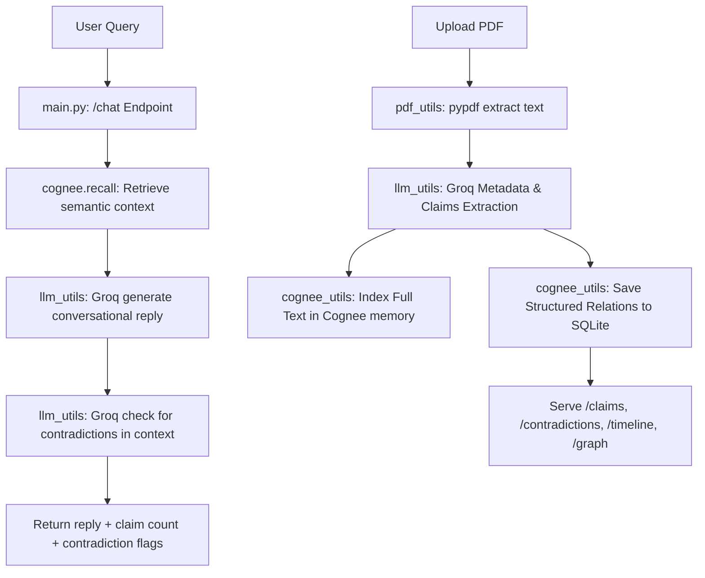

# CogniCite 🔬

CogniCite is a premium, interactive research paper assistant chatbot designed for literature analysis, claim verification, and structural consensus mapping. 

The application utilizes a **FastAPI** backend integrated with **Cognee** for knowledge graph/vector memory, **Groq LLM** for semantic metadata and claims analysis, and a modern **React + Tailwind CSS v4** frontend featuring interactive **D3.js** force-directed relationship mapping.

---

## 🚀 Key Features

*   **Three-Column Dashboard**: Fixed-height premium dashboard interface:
    *   **Left Sidebar**: Scrollable paper library with automated PDF uploads, metadata parsing (authors, year), and color-coded status badges ("claim verified", "contradictions", "under review").
    *   **Center Panel**: Interactive tabs switching between:
        *   **Chat View**: Live conversation supporting multiple query modes (*Cross-paper*, *Single paper*, *Gap finder*, and *Research Qs*) with contradiction warnings and claim support badges.
        *   **Timeline View**: A vertical chronological layout detailing paper summaries and scientific consensus levels.
        *   **Graph Map View**: An interactive force-directed graph built with **D3.js** detailing relations (*supports*, *contradicts*, *extends*) between papers.
    *   **Right Insights Panel**: A live panel showing conflict cards (contradictions list), claims confidence meters (progress bars indicating support vs contradiction ratios), a compact timeline, and a markdown literature review exporter.
*   **Cognee Graph Memory**: Indexes paper text inside Cognee's vector and graph store for precise semantic recall.
*   **Groq LLM Integrations**: Resolves paper metadata, maps claims relations on upload, detects reply conflicts, and compiles structured reviews using `llama-3.3-70b-versatile`.

---

## 🛠️ Architecture



---

## ⚙️ Project Setup

### Prerequisites
*   Python 3.10+ (Tested on Python 3.13.7)
*   Node.js v20+ & npm

### Environment Variables
Configure a `.env` file in the root directory:
```env
# LLM — Groq API Key
LLM_PROVIDER="custom"
LLM_MODEL="groq/llama-3.3-70b-versatile"
LLM_API_KEY="your_groq_api_key_here"

# Embeddings — Ollama Configuration
EMBEDDING_PROVIDER="ollama"
EMBEDDING_MODEL="nomic-embed-text:latest"
EMBEDDING_ENDPOINT="http://localhost:11434/api/embed"
EMBEDDING_DIMENSIONS="768"
HUGGINGFACE_TOKENIZER="nomic-ai/nomic-embed-text-v1.5"

COGNEE_SKIP_CONNECTION_TEST="true"
```

---

## 🏁 How to Run

### 1. Launch FastAPI Backend
From the root directory, activate the Python virtual environment and run the Uvicorn server:
```powershell
# Windows
.\.venv\Scripts\python -m uvicorn backend.main:app --host 127.0.0.1 --port 8000 --reload
```

### 2. Launch React Frontend
Open a new terminal window, navigate to the `frontend/` directory, and launch Vite:
```bash
cd frontend
npm run dev
```

Open **`http://localhost:5173`** in your browser.

---

## 📂 File Structure

```
CogniCite/
├── backend/
│   ├── main.py            # FastAPI routes, CORS, and lifespan config
│   ├── cognee_utils.py    # SQLite database schemas and Cognee remember/recall
│   ├── llm_utils.py       # Groq completion wrappers (metadata, chat, contradictions)
│   └── pdf_utils.py       # PDF text stream extractor
├── frontend/
│   ├── src/
│   │   ├── App.jsx        # Dashboard layout grid and state coordinator
│   │   ├── index.css      # Tailwind CSS v4 imports and scrollbar styles
│   │   └── components/
│   │       ├── Sidebar.jsx       # Paper library list and PDF uploader
│   │       ├── ChatPanel.jsx     # Query chips, message history, and composer
│   │       ├── Timeline.jsx      # Consensus timeline event cards
│   │       ├── GraphMap.jsx      # D3.js force-directed mapping
│   │       └── InsightsPanel.jsx # Contradiction cards, claims bars, and exporters
│   └── vite.config.js     # Tailwind plugin & backend API proxy settings
└── .gitignore             # Ignored files (secrets, database, node_modules, logs)
```
